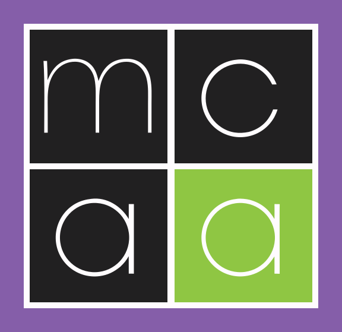

# App icons

All generated from `MCAA_min.svg` — the square 2×2 mark, not the full logo with
the wordmark, because these are rendered as small as 16 px.

| File | Used by |
|---|---|
| `MCAANewsletter.ico` | the `.exe` itself — taskbar, alt-tab (`<ApplicationIcon>` in the csproj) |
| `Square44x44Logo.png` | MSIX: taskbar and app list |
| `Square150x150Logo.png` | MSIX: Start menu tile |
| `StoreLogo.png` | MSIX: the install prompt |

They are committed rather than generated at build time, so neither the build nor
CI needs an SVG rasterizer. To regenerate after editing the SVG, render it to a
512 px PNG and resample — there is no ImageMagick or Inkscape here, but headless
Edge is on every Windows 11 machine:

```powershell
# 1. Render the SVG. render.html is just  sized 512x512.
& "C:\Program Files (x86)\Microsoft\Edge\Application\msedge.exe" `
    --headless=new --disable-gpu --default-background-color=00000000 `
    --force-device-scale-factor=1 --screenshot=logo512.png `
    --window-size=512,512 render.html
```

```python
# 2. Resample. Requires Pillow.
from PIL import Image
im = Image.open("logo512.png").convert("RGBA")
im = im.crop(im.getbbox())                 # trim the bands the 476x459 viewBox leaves
side = max(im.size)
sq = Image.new("RGBA", (side, side), (0, 0, 0, 0))
sq.paste(im, ((side - im.width) // 2, (side - im.height) // 2))

for name, size in [("Square44x44Logo", 44), ("Square150x150Logo", 150), ("StoreLogo", 50)]:
    sq.resize((size, size), Image.LANCZOS).save(f"{name}.png")
sq.save("MCAANewsletter.ico", sizes=[(16,16),(32,32),(48,48),(64,64),(128,128),(256,256)])
```

Only base-size tiles are produced. If the Start menu tile ever looks soft on a
high-DPI screen, add `Square150x150Logo.scale-200.png` (300 px) and friends —
MSIX picks them up by file name, no manifest change.
